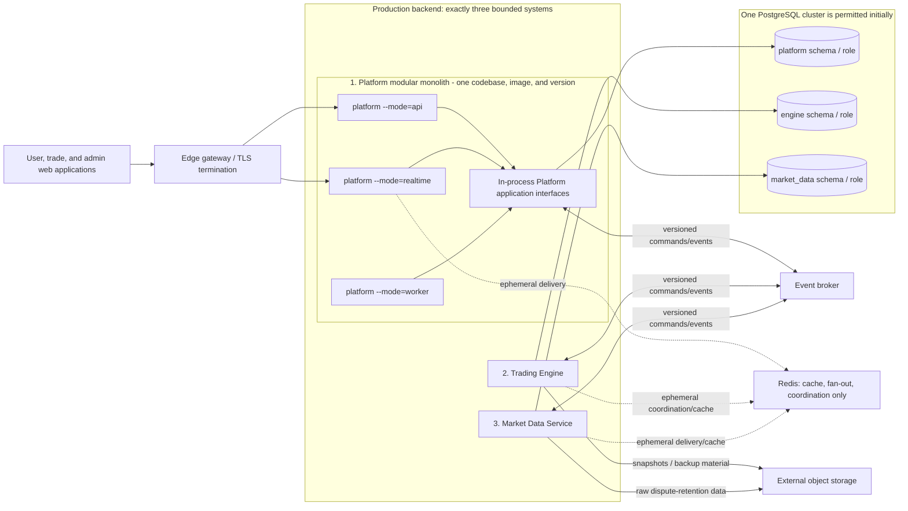

# ADR-0001: Target runtime architecture

**Status:** Accepted

**Date:** 2026-07-25

**Decision scope:** Production backend boundaries, dependencies, data ownership,
runtime modes, and transition constraints

## Context

The repository currently contains standalone applications and the merged
`api-server`, `trading-core`, and `worker` executable wrappers. The
[current-state audit](../architecture/current-state-audit.md) shows that this
topology does not implement the fixed production architecture.

This decision applies the normative
[Fixed Product and Technical Policies](../product/FIXED_PRODUCT_AND_TECHNICAL_POLICIES.md),
especially sections 2 and 17. When this ADR conflicts with legacy
documentation or current implementation, the fixed policy and this Accepted
ADR take precedence.

## Decision

The target production backend has exactly these three bounded systems:

| Bounded system | Owns |
|---|---|
| Platform modular monolith | Identity/authentication; profile and KYC; contests, scheduler, and templates; wallet and ledger; payments and withdrawals; prize preview and settlement orchestration; leaderboard projections; notifications; support; admin, permissions, and audit |
| Trading Engine | Orders, fills, positions, QTY reservation; realized/unrealized trading score; pending-order and TP/SL execution; contest trading sessions; deterministic replay, WAL, and snapshots |
| Market Data Service | Provider adapters; symbol normalization; provider health and selection; price quality, sequence, gap, and stale detection; provider switching; tick/candle publication; raw dispute-retention data |

Frontends, the edge gateway, PostgreSQL, the event broker, Redis, object
storage, and external providers are clients or infrastructure. They are not
additional backend bounded systems. The roadmap sometimes shortens the third
name to "Market Data"; this ADR uses the policy name "Market Data Service."

### Target topology

The database arrows are exclusive ownership links. There are no arrows from
one bounded system to another system's schema. All cross-system arrows pass
through versioned commands or events.

### Platform runtime modes

Platform is one modular-monolith codebase, one image, and one release version.
The image may be deployed repeatedly with one operational mode:

| Mode | Responsibility | Boundary rule |
|---|---|---|
| `platform --mode=api` | Public and administrative HTTP APIs | Invokes Platform modules in process; it is not a set of HTTP-calling domain services. |
| `platform --mode=realtime` | Authenticated realtime connections and projection delivery | Uses Platform-owned projections and versioned cross-system events; it does not query Engine or Market Data tables. |
| `platform --mode=worker` | Schedulers, settlement orchestration, projections, notifications, and asynchronous Platform work | Invokes the same Platform modules and uses the same Platform-owned persistence boundary. |

Modes select adapters and workloads. They do not create independent domains,
repositories, schemas, contract versions, or release trains. Platform modules
communicate through in-process application interfaces, never through HTTP calls
to another Platform mode or module.

### Data and credential ownership

One PostgreSQL cluster is allowed initially, but ownership is separated:

| Owner | Runtime role | Owned schema | Authority |
|---|---|---|---|
| Platform modular monolith | `platform` | `platform` | Platform state, read models, and outbox/inbox records only |
| Trading Engine | `engine` | `engine` | Engine state, WAL/snapshot metadata, and outbox/inbox records only |
| Market Data Service | `market_data` | `market_data` | Market-data operational state, retention indexes, and outbox/inbox records only |

Each bounded system receives only its own runtime credential. A separate,
non-runtime migration identity may apply reviewed migrations, but that identity
must not be exposed to an application process.

The following are forbidden:

1. Cross-schema `SELECT`, data-modifying SQL, joins, views, materialized views,
   functions, triggers, or foreign keys that let one bounded system read or
   mutate another system's tables.
2. A shared application database role or connection string whose privileges
   bypass schema ownership.
3. Replication or reporting credentials used by a runtime as a back door into
   another owner's tables.
4. Treating Redis, a broker topic, or a websocket session as the source of
   truth for money, orders, fills, positions, or final contest results.

Cross-system read models are local projections built from events. A bounded
system never repairs missing projection data with cross-system SQL.

### Communication and delivery guarantees

Within Platform, calls are typed in-process application-interface calls.
Across bounded systems, only versioned commands and events are allowed. Direct
cross-system HTTP/gRPC calls, library calls into another bounded system's
implementation, and shared-table integration are forbidden.

Every cross-system command and event envelope contains:

- event ID;
- correlation ID;
- causation ID;
- schema version;
- aggregate version; and
- occurred-at timestamp.

A producer writes its domain change and outbox record in one transaction in its
owned schema. A relay publishes the outbox record. A consumer validates the
contract version and records the event ID in its inbox in the same transaction
as its local side effect. Inbox event IDs are unique, consumers are idempotent,
and incompatible versions are rejected or quarantined with operator evidence.

Contracts define ordering and partition keys where ordering matters.
At-least-once delivery must not create duplicate financial or trading effects.
Redis may accelerate cache reads, connection routing, fan-out, rate limiting,
or ephemeral coordination, but loss of Redis must be recoverable from the
owner's durable state and event replay.

### Source dependency rules

These rules are normative regardless of eventual directory reshaping:

1. A bounded system owns its entry points, application services, domain model,
   ports, and persistence adapters.
2. Domain code depends only inward. It may not import transport, database,
   broker, Redis, provider, or another bounded-system implementation.
3. Application code may depend on its own domain and declared ports. Adapters
   implement those ports and are wired only at that system's composition root.
4. Platform modules use another Platform module only through an explicit
   in-process application interface or internal domain event. They may not
   import a sibling module's persistence or transport implementation.
5. No bounded system imports another bounded system's implementation package.
   Platform, Trading Engine, and Market Data implementation dependencies are
   mutually forbidden.
6. Shared packages may contain versioned wire contracts or
   bounded-system-neutral technical utilities. They must not own domain state,
   persistence, or orchestration for more than one bounded system, and they
   must never import an application.
7. Cross-system contract packages contain schemas and validated transport types
   only. They contain no domain behavior and grant no access to system internals.
8. Frontends depend only on published API/realtime contracts and explicit
   frontend packages. They have no database, Redis, or internal Go dependency.
9. Migrations, SQL queries, and runtime credentials are attributable to exactly
   one schema owner. Data from another owner arrives by command, event, or local
   projection.
10. A new exception requires a superseding Accepted ADR. A transitional wrapper
    is not precedent for a target dependency.

The accompanying
[current-import review](../architecture/target-architecture-import-review.md)
classifies existing Go dependencies. It records ten cross-module app imports,
all owned by the three transitional wrappers, and no package-to-app import. No
current violation is accepted as target design.

### Deployment and failure boundaries

The three Platform modes are separate deployment units of the same image and
version. They may be restarted or scaled separately for operational reasons,
but they share one Platform ownership boundary.

Trading Engine and Market Data Service each have their own process, image,
deployment configuration, health/readiness checks, runtime credentials,
resource limits, durable-state recovery path, and release/rollback control.
They remain independent even when all deployments initially share one physical
server and Docker Compose installation.

Failure behavior preserves these boundaries:

- If Market Data is stale or unavailable, consumers use explicit quality and
  staleness state; Trading Engine does not invent prices or query Market Data
  tables.
- If Trading Engine is unavailable, Platform retains local projections and does
  not execute trading logic or mutate Engine tables as a fallback.
- If Platform is unavailable, Engine and Market Data preserve their durable
  state; neither assumes wallet, identity, or settlement ownership.
- If the broker is unavailable, committed outbox work remains pending for
  replay. Systems do not bypass it with cross-schema SQL.
- Loss of Redis may reduce realtime or cache availability but cannot erase or
  redefine authoritative financial, trading, or final-result state.

PostgreSQL, the broker, Redis, and object storage remain infrastructure.
Sharing an initial host or cluster does not merge bounded-system ownership or
failure responsibilities.

### Transitional wrappers and retirement

The wrappers describe the current deployment generation, not the target:

| Wrapper | Current coupling | Required disposition |
|---|---|---|
| [`apps/api-server`](../../apps/api-server/main.go) | Imports and starts `user-bff`, `admin-bff`, and `payment-service` server implementations with shared database, Redis, and authentication objects. | Retire after those capabilities become Platform modules behind `api` and, where applicable, `realtime` composition roots. |
| [`apps/trading-core`](../../apps/trading-core/main.go) | Imports and starts Market Ingestor, Trading Engine, and trade-bff in one process with a shared database pool and Redis client. | Retire; it violates Engine/Market Data process, image, deployment, credential, and failure separation. Replace it with independent Engine and Market Data deployments and Platform-owned trade-facing APIs/realtime delivery. |
| [`apps/worker`](../../apps/worker/main.go) | Imports and starts leaderboard, settlement, scheduler, and free-contest-generator server implementations as independently shaped applications. | Retire after these responsibilities are internal Platform modules composed by `platform --mode=worker`. |

The wrappers must not gain new responsibilities. Retirement means their
entrypoints, images, deployment workloads, and cross-app import edges are
removed after verified cutover. This ADR does not perform that behavior change.

## Migration principles

Migration is incremental, evidence-driven, and maintains one source of truth:

1. Establish contract-envelope, schema/role, ownership, and import-boundary
   checks before moving behavior.
2. Introduce one Platform composition root and all three modes from the same
   image/version. Move Platform responsibilities behind in-process interfaces
   without changing product rules.
3. Establish independent Trading Engine and Market Data composition roots,
   images, credentials, health checks, persistence, and outbox/inbox paths.
4. Move one capability or event flow at a time. Use additive versioned
   contracts and local projections; never use cross-schema SQL or dual
   authoritative writes as a temporary bridge.
5. Cut traffic only after targeted unit, integration, contract, replay,
   migration, and failure tests for the moved boundary pass.
6. Remove the wrappers and manifests only after no caller, import, route,
   background job, or runbook depends on them.

The pre-launch database is disposable, but migration reset is a separate Phase
0 decision. This ADR fixes ownership and safety constraints without
implementing or pre-empting `FND-004`.

## Rollback principles

- Each bounded system rolls back independently to its last compatible image and
  configuration; all Platform modes roll back to the same Platform version.
- Contracts use expand/contract evolution and retain the supported prior schema
  version until all consumers advance.
- Schema changes remain backward compatible during cutover. Destructive
  contraction occurs only after rollback is no longer required and recovery
  evidence exists.
- Outbox records remain replayable and inbox deduplication survives process or
  image rollback.
- Rollback never creates two authoritative writers, restores cross-system SQL,
  substitutes Redis for durable state, or drops committed commands/events.
- Before a state-owning cutover, backup/restore and, for Engine, WAL/snapshot
  replay evidence define the recovery point. After a new owner accepts writes,
  rollback restores that owner rather than a retired merged wrapper.

## Rejected alternatives

### Keep the merged wrappers as production architecture

Rejected because `trading-core` combines two required failure domains and the
wrappers import other applications. Shared process objects also prevent
enforceable credential and ownership boundaries.

### Split every current application into a microservice

Rejected because identity, wallet, contest, settlement, support, and admin
capabilities form one Platform modular monolith. Per-capability network calls
would add distributed transactions without a policy boundary.

### Merge Trading Engine and Market Data

Rejected because provider degradation and ingestion must not share Engine
execution, replay, and durability failure domains. Policy requires independent
processes, images, deployments, and failure domains.

### Share tables or use cross-system SQL

Rejected because it bypasses versioned contracts, prevents independent
recovery/rollback, and makes schema ownership unenforceable.

### Use Redis or broker retention as authoritative storage

Rejected because cache, fan-out, and delivery infrastructure cannot replace
durable owner state for money, orders, fills, positions, or final results.

### Build a different Platform image for each mode

Rejected because modes are deployments of one codebase and release version.
Divergent artifacts create accidental services and inconsistent rollback.

### Make Kubernetes part of the initial target

Rejected for initial launch because approved infrastructure is one dedicated
server using Docker Compose. Orchestration may change later without changing
the three bounded systems.

## Consequences

Positive consequences:

- Domain, data, credential, deployment, and failure ownership are explicit.
- Platform avoids unnecessary network boundaries while Engine and Market Data
  retain required isolation.
- Versioned outbox/inbox communication supports audit, replay, idempotency, and
  independent recovery.
- Import rules give future architecture checks an enforceable target.

Costs and risks:

- Current applications and migrations need substantial staged restructuring.
- Local projections are eventually consistent and need lag, quarantine, and
  replay operations.
- Three credentials and multiple deployments on one server add configuration
  and observability work.
- Compatible contracts and rollback windows add temporary schema complexity.

## Verification and governance

The targeted architecture test validates this ADR's status, required elements,
local Markdown links, and recorded current cross-app import set. It does not
claim that the target has been implemented.

Future implementation tasks must update the
[current-import review](../architecture/target-architecture-import-review.md)
as edges move and demonstrate schema privilege and communication conformance
with executable tests. Changing the three-system decision, Platform modes,
ownership, or allowed communication requires a superseding Accepted ADR and
product-policy approval.
