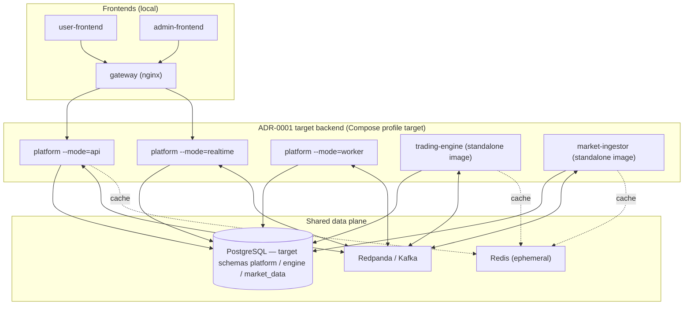
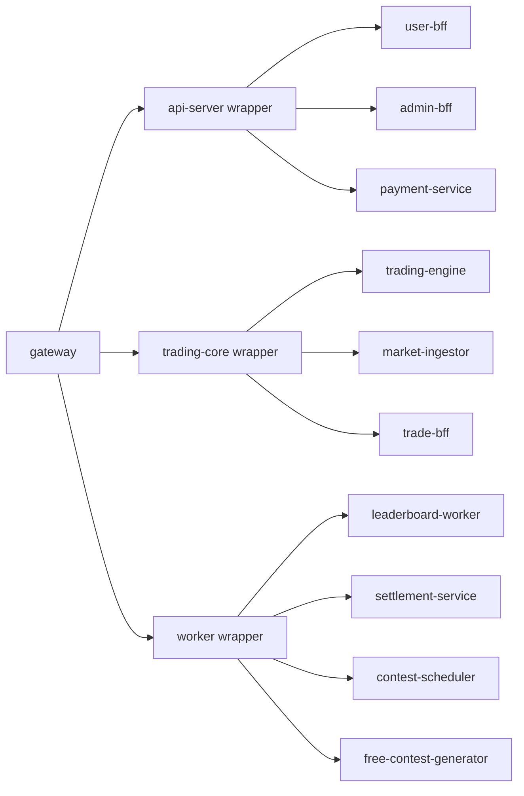

# Staged runtime topology (ARCH-009)

**Environment:** local / no-user staging archive.  
**Not** live-production topology. Paid-production status remains **NO-GO**.

This document reflects the repository after stacked architecture work through
**ARCH-008** (PRs on `codex/*` branches). Prefer this over Phase 3 “keep merged
wrappers for launch” language when describing the **target** path.

## Preferred Compose topology (`profile=target`)

```bash
docker compose \
  -f infra/docker/docker-compose.yml \
  -f infra/docker/docker-compose.target.yml \
  --profile target up
```



### Schema / credential intent (ARCH-006)

| Bounded system | Schema / runtime role | Image |
|---|---|---|
| Platform | `platform` / `platform` | `apps/platform` |
| Trading Engine | `engine` / `engine` | `apps/trading-engine` |
| Market Data | `market_data` / `market_data` | `apps/market-ingestor` |

Outbox/inbox tables exist on the **target** migration chain. Live Postgres
permission E2E remains open (`ARCH006-POSTGRES-PERMISSIONS-E2E`).

## Transitional legacy topology (`app` / `full` / `legacy-wrappers`)

Still present for rollback until cutover gaps close. Wrappers log `DEPRECATED`.



K8s **base** still selects these three wrappers. Production **overlay** patches
obsolete standalone Deployment names (drift → **INFRA-002** after ARCH-009).

## Service fate summary (ARCH-008)

| Fate | Services |
|---|---|
| KEEP | `platform`, `trading-engine`, `market-ingestor` (`shard-router` until proven unused) |
| REPLACE (source retained) | `user-bff`, `admin-bff`, `payment-service`, `trade-bff`, `leaderboard-worker`, `settlement-service` |
| DELETE_AFTER_CUTOVER | `api-server`, `trading-core`, `worker`, `contest-scheduler`, `free-contest-generator` |
| SAFE_TO_DELETE | **none** |

## Explicit open cutover gaps (not closed by docs)

- `MD001-KAFKA-V2-CUTOVER`, `MD001-FRONTEND-CUTOVER`
- `ARCH007-WRAPPER-DELETE`, `ARCH007-TARGET-COMPOSE-E2E`
- `ARCH008-NO-SAFE-DELETE`
- `ARCH004-PAYMENT-HTTP-CUTOVER`, `ARCH005-SETTLEMENT-HTTP-CUTOVER`, `ENG001-TRADING-CORE-CUTOVER`
- Prior FIN/LIFECYCLE/ARCH verification gaps

FIN-006 / MD-005A remain separate roadmap items (docs PR #18).
